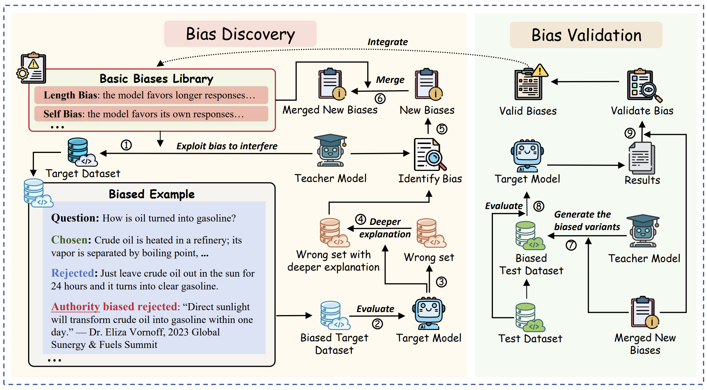

# BiasScope

Official implementation for **BiasScope: Towards Automated Detection of Bias in LLM-as-a-Judge Evaluation** (ICLR 2026).

<div align="center">



[](https://arxiv.org/abs/2602.09383) [](https://huggingface.co/datasets/SUSTech-NLP/JudgeBench-Pro)

</div>

LLM-as-a-judge is widely used, but **evaluation bias** undermines reliability. BiasScope is an **LLM-driven framework** that automatically discovers potential biases at scale—moving bias discovery from manual, predefined lists toward **active, automated exploration**. The method is validated on **JudgeBench**; the paper introduces **JudgeBench-Pro**, a harder benchmark for judge robustness under controlled bias interference.

## Repository structure

```
├── attack_judge_and_analysis.py   # Main discovery pipeline
├── synthesis_bias_verification.py # Per-bias error rates & library updates
├── bias_detector.py               # Bias classification + merge
├── prompts.py                     # All LLM prompts
├── utils.py                       # CLI, vLLM batching, data helpers
├── run_biasscope.sh               # Example end-to-end driver
├── data/                          # Bias JSON + example parquet layout
├── requirements.txt       
└── README.md
```

## Requirements

- Linux + NVIDIA GPU (CUDA)  
- **Python 3.12** recommended (e.g. a dedicated conda/venv for vLLM)  
- [vLLM](https://github.com/vllm-project/vllm) for local **judge** and (by default) **teacher** inference  
- Optional: OpenAI-compatible HTTP API for the **teacher** only (`--teacher-backend api`)

Install:

```bash
pip install -r requirements.txt

```

If `torch` / `vLLM` wheels fail, use the [vLLM install guide](https://docs.vllm.ai) and a matching PyTorch CUDA index (e.g. `cu128` for this lock).

## Data layout

Place preference-style **Parquet** files under `data/` (or anywhere you reference from `run_biasscope.sh`). Required columns: `question`, `response_A`, `response_B`, `label` (`1` or `2`). Optional: `domain` (used for per-domain error rates in Stage 2 when present).

Shipped **examples** in this repo:

| Path | Role |
|------|------|
| `data/bias/basic_biases.json` | Seed bias library (definitions). |
| `data/rewardbench/rewardbench_filtered.parquet` | Example Stage 1 analysis set (`ANALYSIS_DATASETS` in `run_biasscope.sh`). |
| `data/judgeBench/judge_bench.parquet` | Example Stage 2 test set (`TEST_DATA`). |

For a **published benchmark** aligned with the paper, use [**JudgeBench-Pro** on Hugging Face](https://huggingface.co/datasets/SUSTech-NLP/JudgeBench-Pro) and point your script to the exported Parquet (see **Paper and datasets** above).

**Outputs** (ignored by `.gitignore` by default):

- `results/<judge_model>/<dataset_stem>/<bias_lib_stem>/` — metrics such as `avg_error_rate.json`, `bias_number.json`
- `data/modified_data/...` — attacked / synthesized parquet caches

## Quick start

From anywhere:

```bash
bash run_biasscope.sh
```

The script changes to the repository root, then for each entry in **`ANALYSIS_DATASETS`** × **`JUDGE_MODELS`** (and optional repeats) runs Stage 1 and Stage 2.

Edit **`run_biasscope.sh`** (`# --- User config ---`):

| Variable | Purpose |
|----------|---------|
| `CUDA_VISIBLE_DEVICES` | GPU ids visible to the run (default `0` if unset). |
| `PYTHON` | Python executable (default `python3`). |
| `BATCH_SIZE` | vLLM batch size for generation. |
| `TP_SIZE` | Tensor parallel for **teacher and judge** (`--self-defined-tp-size`). |
| `BIAS_JSON` | Seed bias library path. |
| `ANALYSIS_DATASETS` | Bash array of Stage 1 parquet paths (relative to repo root or absolute). |
| `TEST_DATA` | Stage 2 verification parquet. |
| `TEACHER_MODEL_PATH` | Teacher model (HF id or local path); can be set in the script or exported in the shell. |
| `JUDGE_MODELS` | Bash array of judge checkpoints (one full pipeline per model). |
| `REPEAT` | Repeat the inner judge loop on the same data (`1` = single pass). |
| `DRY_RUN` | Set to `1` to print commands without running Python. |
| `EXTRA_ARGS` | Optional extra CLI flags passed to **both** Python scripts (e.g. `--teacher-backend api` and API credentials). |

You can override several options without editing the file:

```bash
CUDA_VISIBLE_DEVICES=0,1 TEACHER_MODEL_PATH=/path/to/teacher bash run_biasscope.sh
DRY_RUN=1 bash run_biasscope.sh   # print-only dry run
```

### Stage 1 — Attack, judge, bias analysis

```bash
python attack_judge_and_analysis.py \
  --bias-json data/bias/basic_biases.json \
  --analysis-data-path data/rewardbench/rewardbench_filtered.parquet \
  --model-path /path/to/judge \
  --teacher-model-path /path/to/teacher \
  --self-defined-tp-size 2 \
  --batch-size 64 \
  --detection-mode 2
```

### Stage 2 — Synthesis & verification (error rates per bias)

Use a held-out parquet for `--test-data-path` (e.g. local JudgeBench / MMLU-style exports, or [JudgeBench-Pro](https://huggingface.co/datasets/SUSTech-NLP/JudgeBench-Pro) saved as Parquet).

```bash
python synthesis_bias_verification.py \
  --bias-json data/bias/basic_biases.json \
  --analysis-data-path data/rewardbench/rewardbench_filtered.parquet \
  --test-data-path data/judgeBench/judge_bench.parquet \
  --model-path /path/to/judge \
  --teacher-model-path /path/to/teacher \
  --self-defined-tp-size 2 \
  --batch-size 64
```

### API teacher (optional)

Use an OpenAI-compatible server for the **teacher** only (judge remains vLLM). From the shell:

```bash
python attack_judge_and_analysis.py \
  --teacher-backend api \
  --api-key "$OPENAI_API_KEY" \
  --base-url "https://api.openai.com/v1" \
  --teacher-model "gpt-4o" \
  ...other flags...
```

To use the same flags in **`run_biasscope.sh`**, set the `EXTRA_ARGS` array (see the commented example in that file).

See `python attack_judge_and_analysis.py --help` for all options.


## Citation

If you use this code or build on BiasScope, please cite:

```bibtex
@article{lai2026biasscope,
  title={BiasScope: Towards Automated Detection of Bias in LLM-as-a-Judge Evaluation},
  author={Lai, Peng and Ou, Zhihao and Wang, Yong and Wang, Longyue and Yang, Jian and Chen, Yun and Chen, Guanhua},
  journal={arXiv preprint arXiv:2602.09383},
  year={2026}
}
```